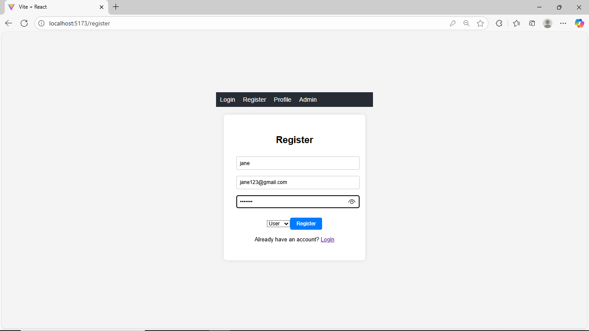
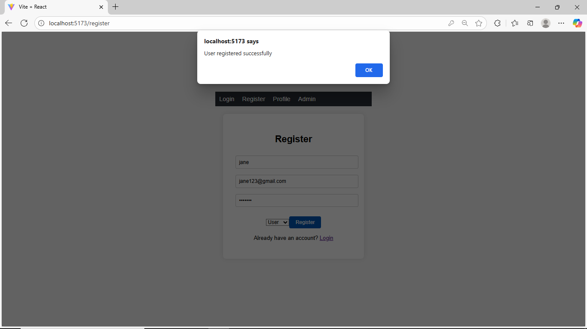
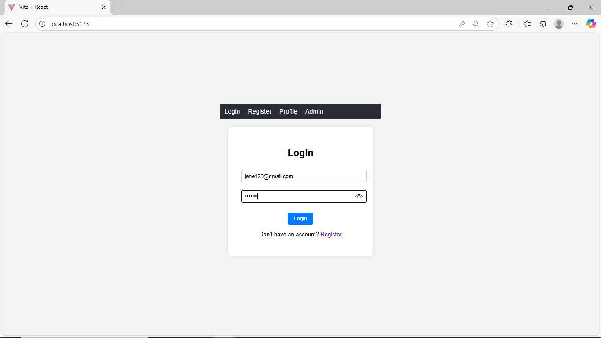
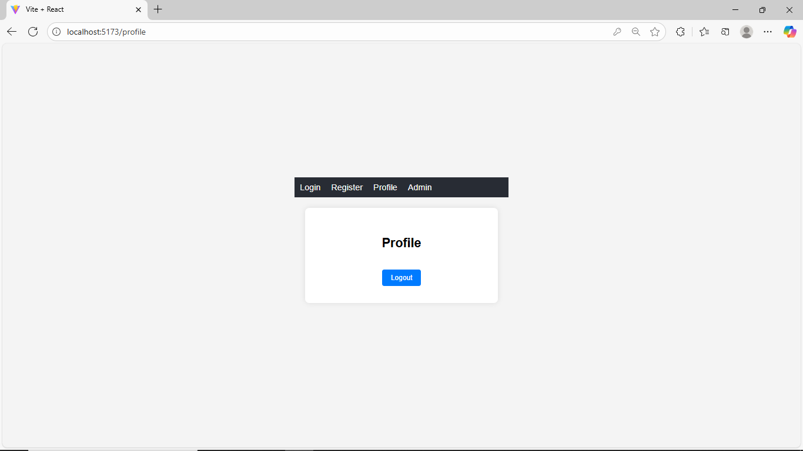
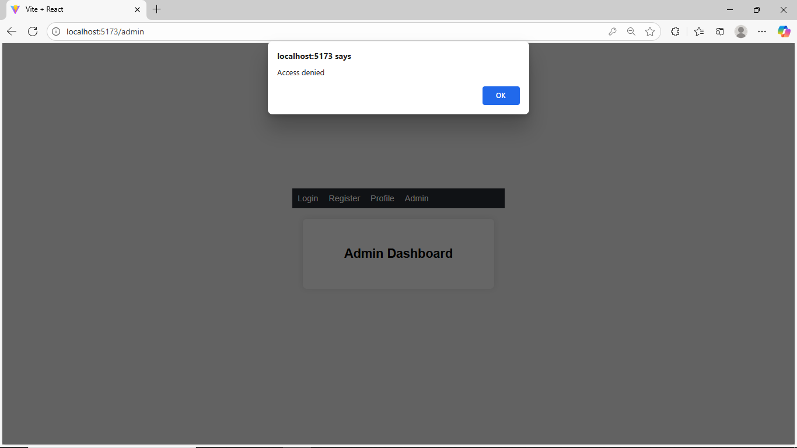
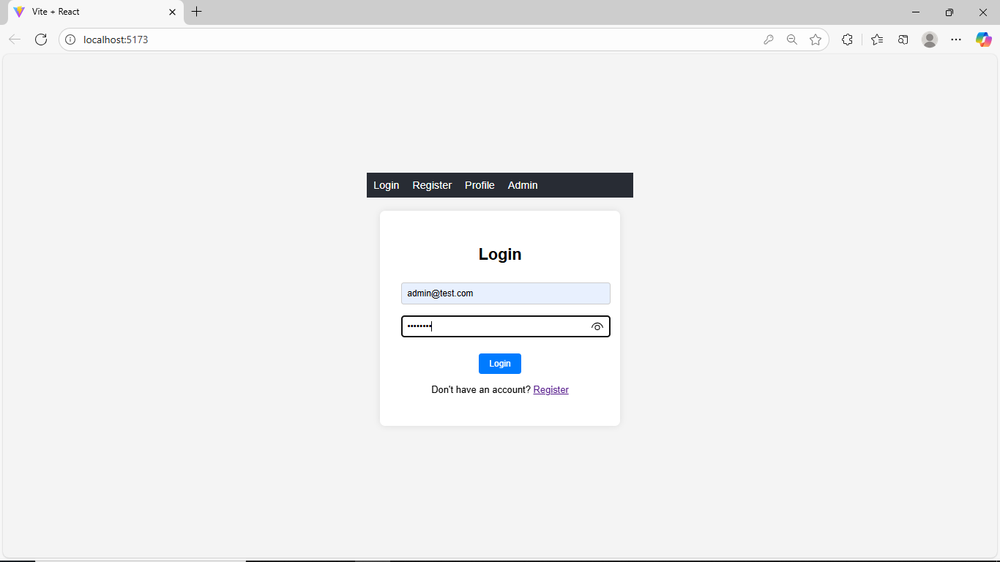
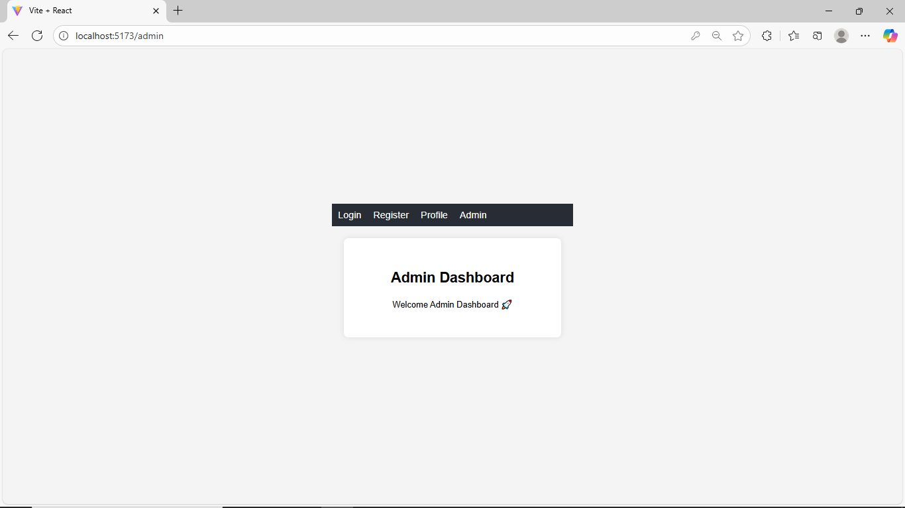

# MERN JWT Authentication Project

A full-stack MERN (MongoDB, Express.js, React, Node.js) application implementing JWT (JSON Web Token) authentication with role-based access control. This project demonstrates secure user registration, login, and protected routes for both regular users and administrators.

## Features

- **User Authentication**: Secure registration and login with JWT tokens
- **Role-Based Access Control**: Separate permissions for users and admins
- **Password Hashing**: Secure password storage using bcrypt
- **Protected Routes**: Middleware to verify JWT tokens and user roles
- **Responsive UI**: Modern React frontend with routing
- **MongoDB Integration**: NoSQL database for user data storage
- **CORS Support**: Cross-origin resource sharing enabled
- **Default Admin Account**: Pre-configured admin user for testing

## Tech Stack

### Backend
- **Node.js** - Runtime environment
- **Express.js** - Web framework
- **MongoDB** - NoSQL database
- **Mongoose** - ODM for MongoDB
- **JWT** - Token-based authentication
- **bcryptjs** - Password hashing
- **CORS** - Cross-origin resource sharing

### Frontend
- **React** - UI library
- **Vite** - Build tool and dev server
- **React Router** - Client-side routing
- **ESLint** - Code linting

## Prerequisites

Before running this project, make sure you have the following installed:

- **Node.js** (v14 or higher)
- **MongoDB** (local installation or MongoDB Atlas)
- **npm** or **yarn** package manager

## Installation & Setup

### Backend Setup

1. Navigate to the backend directory:
   ```bash
   cd jwt
   ```

2. Install dependencies:
   ```bash
   npm install
   ```

3. Create a `.env` file in the `jwt` directory and add your JWT secret:
   ```env
   JWT_SECRET=your_jwt_secret_here
   PORT=5000
   ```
   
   To generate a secure JWT secret, run:
   ```bash
   node -e "console.log(require('crypto').randomBytes(64).toString('hex'))"
   ```

4. Start MongoDB service (if running locally)

5. Start the backend server:
   ```bash
   npm run dev
   ```
   
   The server will run on `http://localhost:5000`

### Frontend Setup

1. Navigate to the frontend directory:
   ```bash
   cd jwt_frontend/vite-project
   ```

2. Install dependencies:
   ```bash
   npm install
   ```

3. Start the development server:
   ```bash
   npm run dev
   ```
   
   The frontend will run on `http://localhost:5173` (default Vite port)

## Usage

1. **Register**: Create a new user account
2. **Login**: Authenticate with email and password
3. **Profile**: Access user dashboard (protected route)
4. **Admin Dashboard**: Access admin-only features (requires admin role)

### Default Admin Credentials

- **Email**: admin@test.com
- **Password**: admin123

## API Endpoints

### Authentication
- `POST /register` - User registration
- `POST /login` - User login

### Protected Routes
- `GET /admin` - Admin dashboard (admin role required)

## Project Structure

```
JWT_project/
├── jwt/                          # Backend
│   ├── models/
│   │   └── User.js              # User model
│   ├── package.json
│   ├── server.js                # Main server file
│   └── readme.txt               # Backend setup notes
├── jwt_frontend/
│   └── vite-project/            # Frontend
│       ├── public/
│       ├── src/
│       │   ├── component/
│       │   │   ├── Login.jsx
│       │   │   ├── Register.jsx
│       │   │   ├── Profile.jsx
│       │   │   └── Admin.jsx
│       │   ├── App.jsx
│       │   └── main.jsx
│       ├── package.json
│       └── vite.config.js
├── outputscreens/               # Screenshots
└── README.md                    # This file
```

## Screenshots

Here are some screenshots of the application showcasing key features and UI:

<p align="center">
  
  
</p>
<p align="center">
  
  
</p>
<p align="center">
  
  
</p>
<p align="center">
  
</p>

## Contributing

1. Fork the repository
2. Create a feature branch (`git checkout -b feature/amazing-feature`)
3. Commit your changes (`git commit -m 'Add some amazing feature'`)
4. Push to the branch (`git push origin feature/amazing-feature`)
5. Open a Pull Request

## Acknowledgments

- Built following MERN stack best practices
- JWT implementation for secure authentication
- Role-based access control for different user types

