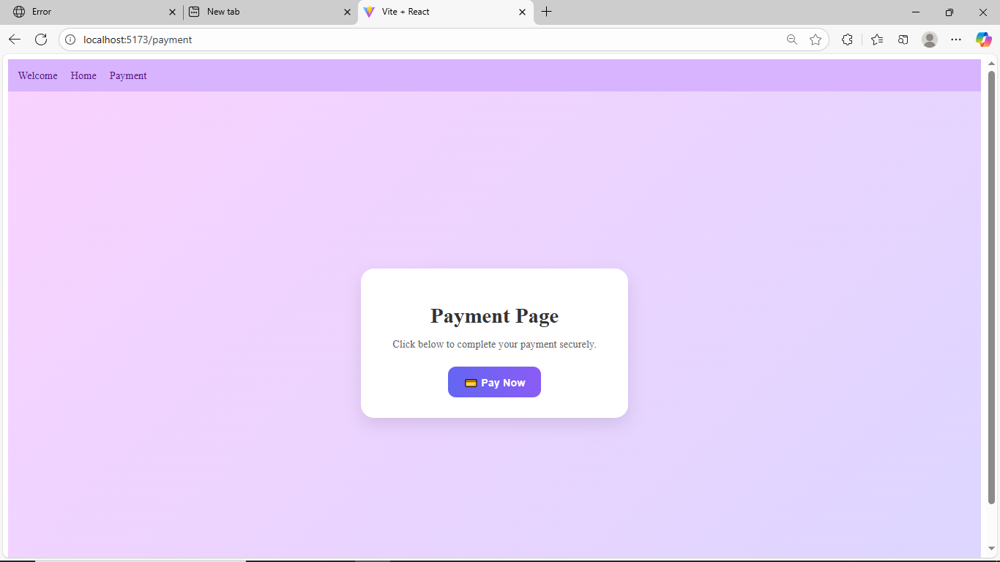
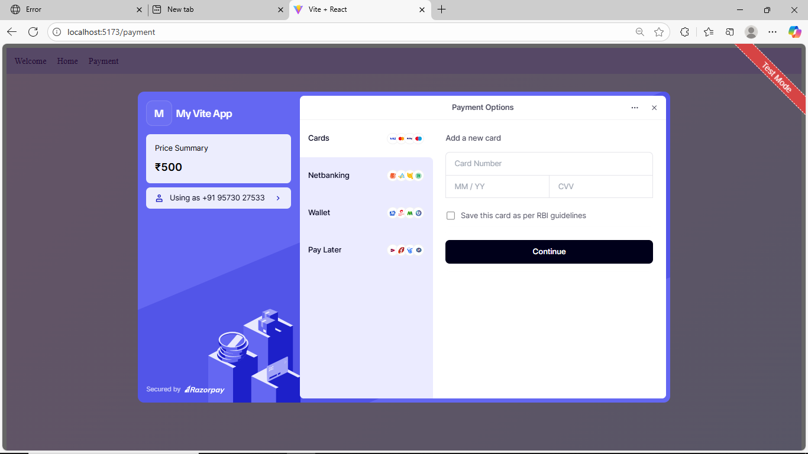
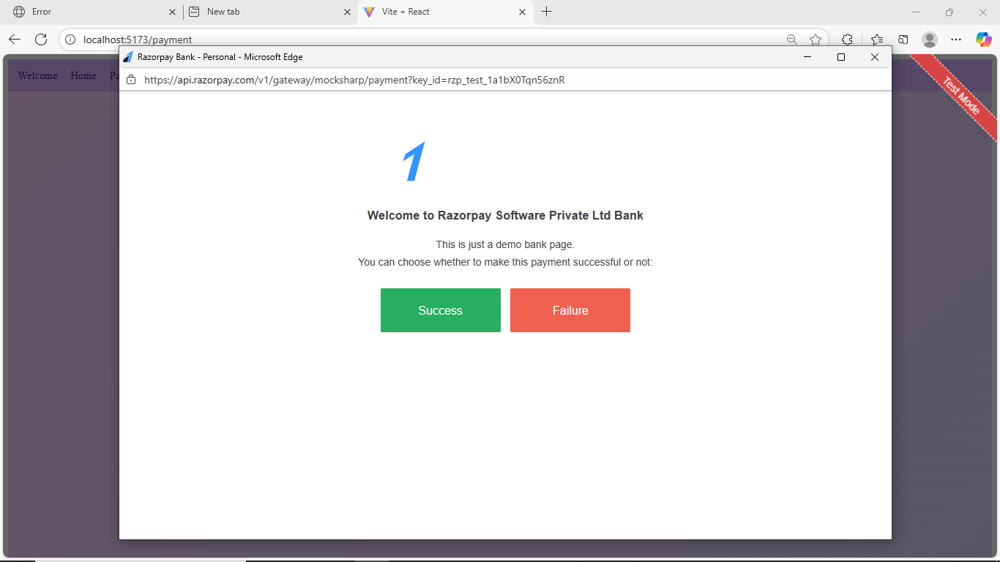
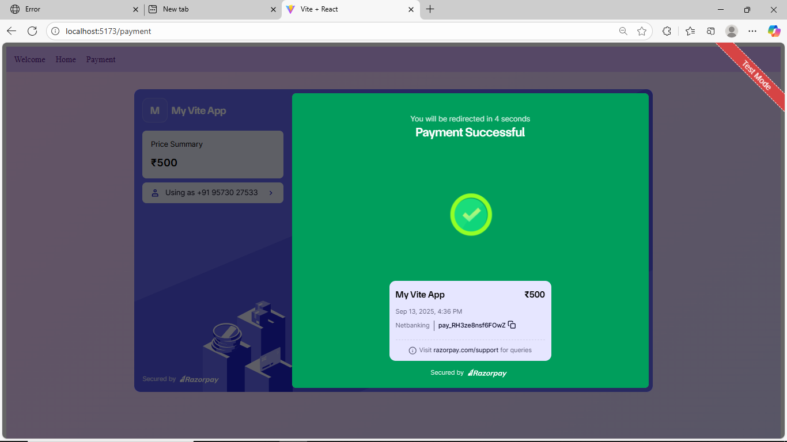

# RazorPay Payment Integration with Express.js

This project is a backend service built with Express.js that integrates Razorpay payment gateway for creating orders and saving payment details. It uses MongoDB with Mongoose for storing payment information.

## Technologies Used

- Node.js
- Express.js
- MongoDB & Mongoose
- Razorpay Node SDK
- dotenv for environment variables
- body-parser for parsing JSON requests
- cors for Cross-Origin Resource Sharing

## Setup Instructions

1. Clone the repository and navigate to the `ExpressNew` directory.

2. Install dependencies:

```bash
npm install
```

3. Create a `.env` file in the root of `ExpressNew` and add the following environment variables:

```
MONGO_URI=your_mongodb_connection_string
RAZORPAY_KEY_ID=your_razorpay_key_id
RAZORPAY_KEY_SECRET=your_razorpay_key_secret
PORT=5000
```

4. Start the server in development mode (with nodemon):

```bash
npm run dev
```

Or start normally:

```bash
npm start
```

The server will run on `http://localhost:5000` by default.

## API Endpoints

### POST /create-order

Creates a Razorpay order.

- Request body parameters:
  - `amount` (Number): Amount in the smallest currency unit (e.g., paise for INR).
  - `currency` (String): Currency code (e.g., "INR").
  - `receipt` (String, optional): Receipt identifier.

- Response: Razorpay order object.

### POST /save-payment

Saves payment details after a successful payment.

- Request body parameters:
  - `razorpay_payment_id` (String)
  - `razorpay_order_id` (String)
  - `razorpay_signature` (String)
  - `amount` (Number)
  - `currency` (String)

- Response: Success message.

## Preview

Below are some screenshots demonstrating the output and flow of the application:

<div style="display: flex; justify-content: center; gap: 20px; flex-wrap: wrap;">
  <div style="flex: 1 1 200px; text-align: center;">
    
    <p>Screenshot 1</p>
  </div>
  <div style="flex: 1 1 200px; text-align: center;">
    
    <p>Screenshot 2</p>
  </div>
  <div style="flex: 1 1 200px; text-align: center;">
    
    <p>Screenshot 3</p>
  </div>
  <div style="flex: 1 1 200px; text-align: center;">
    
    <p>Screenshot 4</p>
  </div>
</div>
