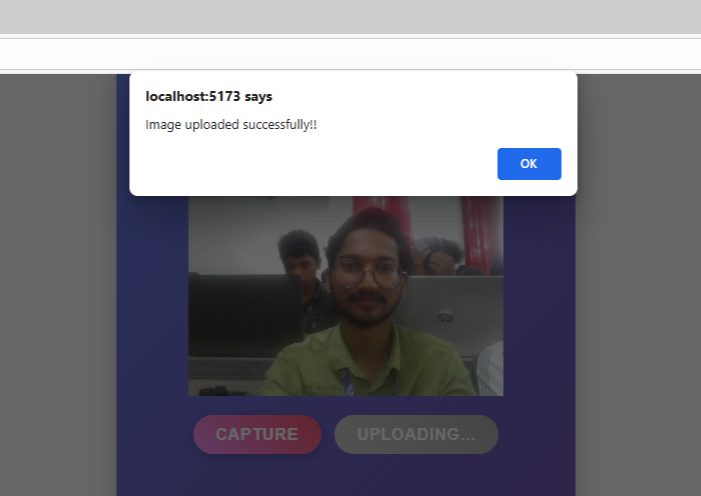
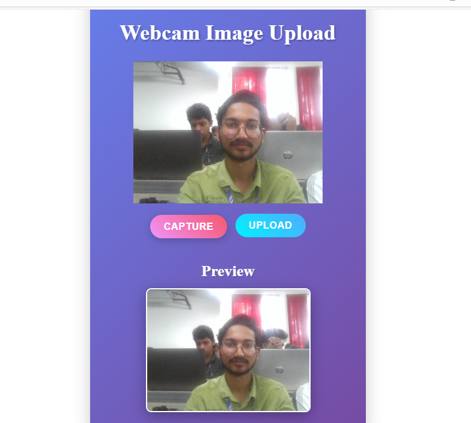
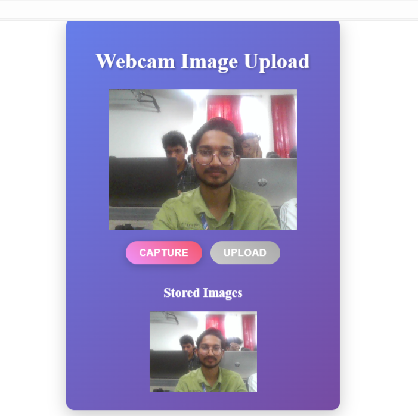

# Webcam Image Upload Project

This project is a full-stack application that allows users to capture images from their webcam, upload them to a backend server, and view stored images. It consists of a Node.js/Express backend connected to a MongoDB database and a React frontend using Vite and react-webcam.

## Technologies Used

- Backend:
  - Node.js
  - Express
  - MongoDB with Mongoose
  - CORS
  - dotenv

- Frontend:
  - React
  - Vite
  - react-webcam

## Backend Overview

The backend provides REST API endpoints to:

- Upload an image captured from the webcam (`POST /upload`)
- Retrieve stored images (`GET /images`)

Images are stored in MongoDB as base64-encoded strings along with their creation timestamps.

## Frontend Overview

The frontend allows users to:

- Capture images from their webcam using the react-webcam library
- Preview the captured image before uploading
- Upload the image to the backend server
- View previously uploaded images fetched from the backend


## 📸 Preview

<div align="center">
  <table>
    <tr>
      <td></td>
      <td></td>
    </tr>
    <tr>
      <td></td>
      <td></td>
    </tr>
  </table>
</div>


## Getting Started

### Prerequisites

- Node.js and npm installed
- MongoDB instance running and accessible
- Environment variable `MONGO_URI` set with your MongoDB connection string

### Backend Setup

1. Navigate to the backend directory:

   ```bash
   cd wc_backend
   ```

2. Install dependencies:

   ```bash
   npm install
   ```

3. Create a `.env` file in the `wc_backend` directory and add your MongoDB URI:

   ```
   MONGO_URI=your_mongodb_connection_string
   ```

4. Start the backend server:

   ```bash
   npm run dev
   ```

   The backend server will run on port 5000 by default.

### Frontend Setup

1. Navigate to the frontend directory:

   ```bash
   cd wc_frontend
   ```

2. Install dependencies:

   ```bash
   npm install
   ```

3. Start the frontend development server:

   ```bash
   npm run dev
   ```

4. Open the URL shown in the terminal (usually `http://localhost:5173`) in your browser to use the app.

## License

This project is licensed under the ISC License.

## Author

[Your Name Here]

